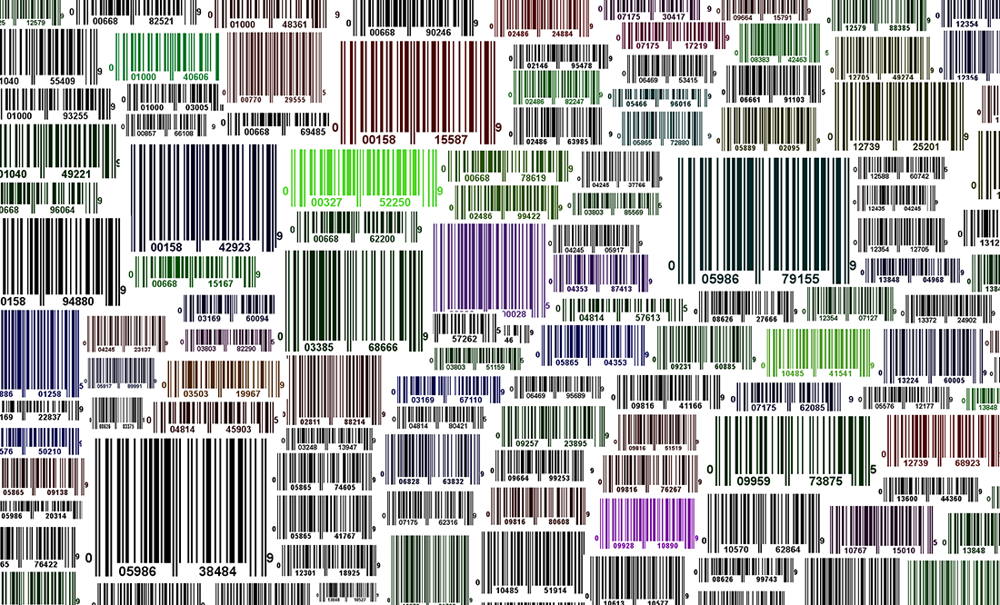
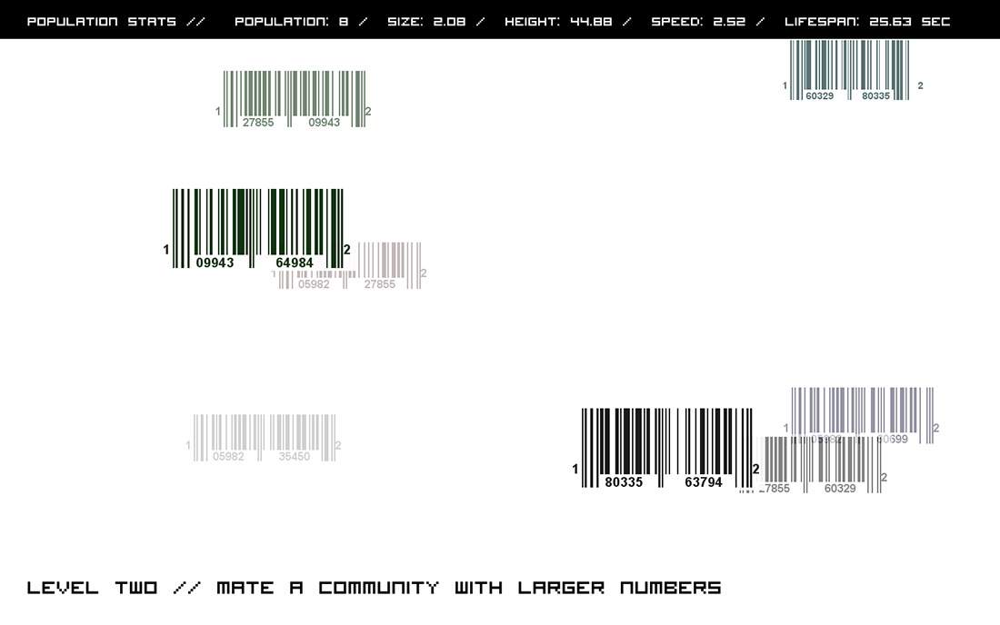
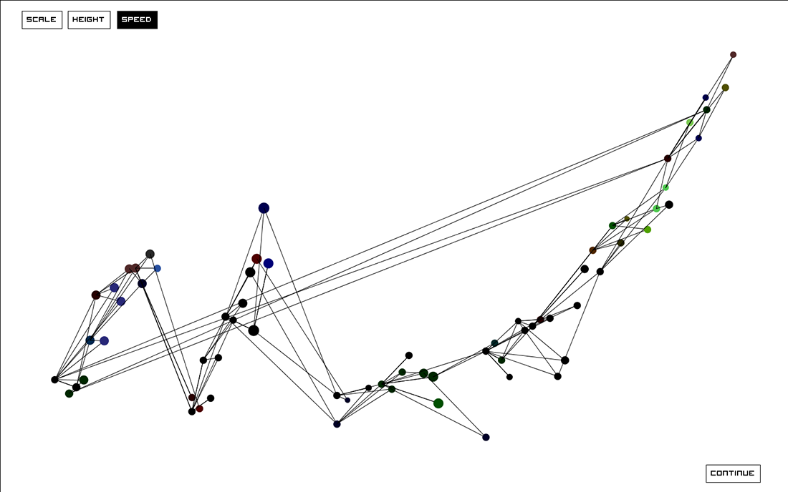

##An Experiment in Mating Barcodes

 *An Experiment in Mating Barcodes* is a video game where players build their own simulated 
community of animated and interactive Universal Product Code (UPC) barcodes. Players 
use a usb barcode scanner both as a game controller and a tool to scan real barcodes 
into the game from the objects around them. 

The game begins as the player scans two barcodes from any products they have nearby. 
These first barcodes represent a sort of “Adam and Eve” for the community that the 
player builds throughout the game. Each barcode has its own unique attributes of size,
 height, speed, lifespan, and sometimes even its own distinct color. 

The community grows as in-game barcodes are mated with each other by scanning 
them on-screen. A child barcode appears with the most desirable attributes from 
both parents. For instance, if a barcode’s father is fast, and its mother is tall, the
 child barcode will most likely be both fast and tall. Player’s must breed on screen 
 barcodes with each other in different ways in order to meet each level’s objective 
 and progress through the game. At the end of each level an interactive “family tree” 
 appears to help visualize the ancestral relationships between every barcode in the 
 game so far.

 *An Experiment in Mating Barcodes* is both a game and a critical response to the
 ways that a system of manufactured objects exist and operate in contemporary life. 

Products, now more than ever, are nonrepresentative of natural growth. As methods of
fabrication and product design progress objects are becoming more abstracted from 
the basic archetypes that have been associated with them. Objects, especially electronic
 devices, no longer look like combinations of the natural resources that they are made 
 up of. They seemingly exist as there own near impossible creations connected in no way 
 with the natural or biological world. *An Experiment in Mating Barcodes* attempts to 
 highlight these ideas by creating a game using ideas of evolution and natural selection 
 by means of an abstracted consumer indexing system. 
